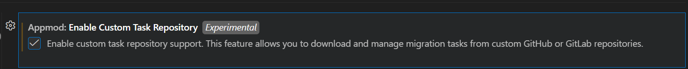
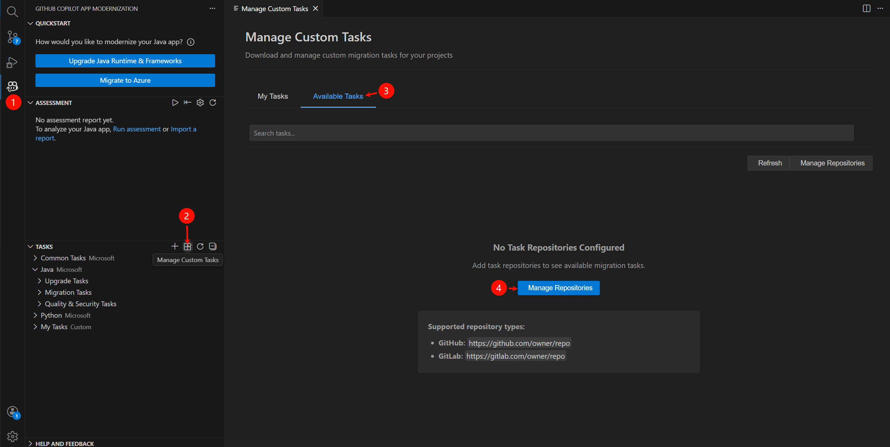
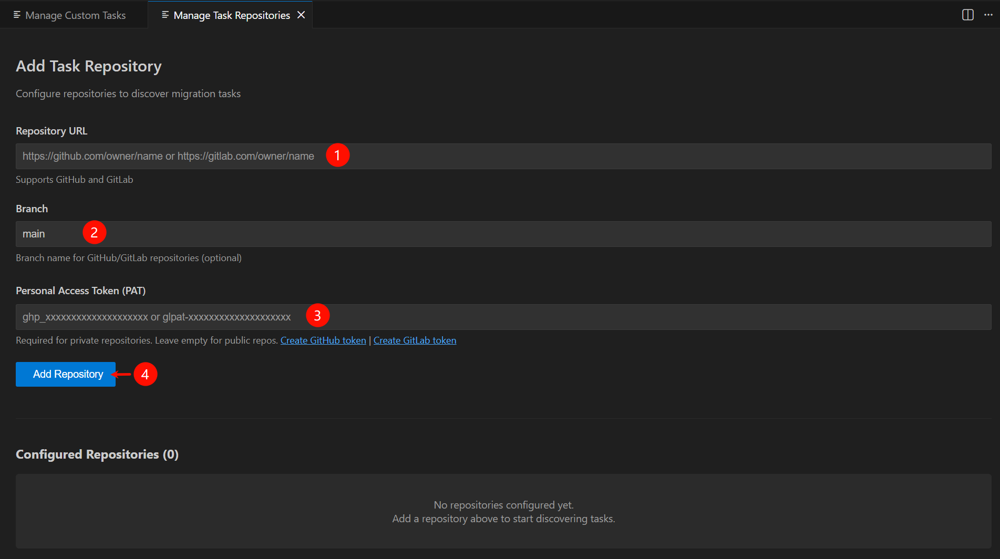

# Custom Tasks Template Repository

A template repository for hosting custom migration tasks for the [GitHub Copilot App Modernization VS Code extension](https://marketplace.visualstudio.com/items?itemName=vscjava.migrate-java-to-azure).

## Overview

This repository serves as a template for teams to create and maintain their own private custom migration tasks. Clone or fork this repository to your Github, GitLab, or other Git hosting service to start building your own task library.

## Quick Start

### Setting Up Your Repository

1. Clone this template repository to your Github, GitLab, or other Git hosting service
2. Start adding your custom migration tasks

### Configuring the App Modernization Extension to use Your Repository
  
1. Enable the [appmod.enableCustomTaskRepository](https://vscode.dev/redirect?url=vscode://settings/appmod.enableCustomTaskRepository) setting to use custom task repositories.

2. Open the **GitHub Copilot App Modernization** extension in the Side Bar.

3. Click the **Manage Custom Tasks** button in the **Tasks** view title bar.
4. Switch to the **Available Tasks** tab.
5. Click the **Manage Repositories** button to add your repository.



### Adding a New Task to Your Repository

1. Create a new folder in `tasks/` with your task ID (e.g., `tasks/mysql-to-postgresql`)
2. Add required files following the [Task Format Specification](#task-format-specification)
3. Run `npm start` in the root directory to update metadata.json so the extension can recognize your new task.
4. Commit and push your changes to your repository

## Repository Structure

```
appmod-custom-tasks/
├── metadata.json              # Auto-generated task index
├── README.md                  # This file
├── CONTRIBUTING.md            # Contribution guidelines
├── scripts/
│   ├── generate-metadata.js   # Generates metadata.json
│   ├── validate-task.js       # Validates task format
│   ├── lib/                   # Shared utilities
│   └── package.json           # Node.js dependencies
└── tasks/                     # All task folders go here
    └── <task-id>/
        ├── task.md            # Main task definition (required)
        └── ...                # Additional files (optional)
```

## Task Format Specification

### Folder Structure

Each task must be in its own folder inside the `tasks/` directory:

```
tasks/
└── my-task-id/
    ├── task.md                    # Required: Main task definition
    ├── example-before.java        # Optional: Before code example
    ├── example-after.java         # Optional: After code example
    ├── config.properties.template # Optional: Configuration template
    └── README.md                  # Optional: Additional documentation
```

### Naming Conventions

- **Folder name**: Lowercase with hyphens (e.g., `aws-s3-to-azure-blob`)
- **Folder name should match the task ID** in the frontmatter

### task.md Requirements

The `task.md` file must include YAML frontmatter and follow the standard format:

```markdown
---
id: my-task-id
name: Human Readable Task Name
type: task
---

**Prompt:**

Your task prompt content here...

**References:**
- file:///example.java
- git+file:///changes.diff
- https://docs.microsoft.com/azure/...
```

#### Required Sections

| Section | Required | Description |
|---------|----------|-------------|
| YAML Frontmatter | ✅ Yes | Must include `id`, `name`, `type` fields |
| `**Prompt:**` | ✅ Yes | Main task description/prompt |
| `**References:**` | ⚠️ Recommended | List of file and URL references |

#### Frontmatter Fields

| Field | Description | Example |
|-------|-------------|---------|
| `id` | Unique identifier (should match folder name) | `aws-s3-to-azure-blob` |
| `name` | Human-readable display name | `Migrate AWS S3 to Azure Blob Storage` |
| `type` | Task type (currently only `task`) | `task` |

#### Task Constraints

- **Unique ID**: Each task must have a unique `id` in the frontmatter. Duplicate IDs are not allowed and will cause the metadata generation to fail.
- **ID Format**: Task IDs should be lowercase with hyphens (e.g., `kafka-to-eventhubs`).
- **Folder-ID Match**: The task folder name should match the `id` field in the frontmatter.

#### References Format

The `**References:**` section links to supporting files and documentation:
> You can add references, for example code diffs to your task. Supported formats include:

- **Local files**: `file:///filename.java` - References files in the same task folder
- **Diff files**: `git+file:///changes.diff` - Git diff files for code changes
- **URLs**: `https://docs.example.com/` - External documentation links

> **Note:** When you run `npm start`, the script automatically syncs file references with actual files in the task folder.

### Additional Files

You can include any supporting files in your task folder:

- **Code examples** (`.java`, `.py`, `.cs`, etc.)
- **Configuration templates** (`.properties`, `.yml`, `.json`)
- **Git diff files** (`.diff`, `.patch`)
- **Documentation** (`.md`)

All files should be placed directly in the task folder.

## Development

### Prerequisites

- Node.js 18+ 
- npm

### Setup

```bash
npm install
```

### Generate Metadata

After adding or modifying tasks, regenerate the metadata:

```bash
npm start
```

### Validate Tasks

To validate task format locally:

```bash
npm run validate
```

### Types of Contributions

- 🆕 **New Tasks**: Migration patterns for different technologies
- 🐛 **Bug Fixes**: Fixes to existing tasks
- 📖 **Documentation**: Improvements to task documentation

## License

This project is licensed under the MIT License - see the [LICENSE](LICENSE) file for details.
